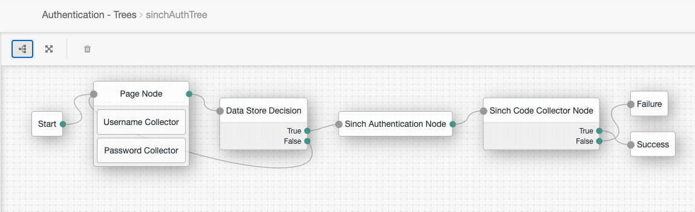

<!--
 * The contents of this file are subject to the terms of the Common Development and
 * Distribution License (the License). You may not use this file except in compliance with the
 * License.
 *
 * You can obtain a copy of the License at legal/CDDLv1.0.txt. See the License for the
 * specific language governing permission and limitations under the License.
 *
 * When distributing Covered Software, include this CDDL Header Notice in each file and include
 * the License file at legal/CDDLv1.0.txt. If applicable, add the following below the CDDL
 * Header, with the fields enclosed by brackets [] replaced by your own identifying
 * information: "Portions copyright [year] [name of copyright owner]".
 *
 * Copyright ${data.get('yyyy')} ForgeRock AS.
-->
# sinchAuthNode

A simple authentication node for ForgeRock's [Identity Platform][forgerock_platform] 5.5 and above. This node integrates Sinch phone number verification service with AM.
Currently plugin supports verifications via SMS, flashcalls and callouts.

## Usage
Copy the .jar file from the releases tab of Github into the ../web-container/webapps/openam/WEB-INF/lib directory where AM is deployed.  Restart the web container to pick up the new node.  The node will then appear in the authentication trees components palette.

The code in this repository has binary dependencies that live in the ForgeRock maven repository. Maven can be configured to authenticate to this repository by following the following [ForgeRock Knowledge Base Article](https://backstage.forgerock.com/knowledge/kb/article/a74096897).

### SinchAuthenticationNode

This node initiates the verification process. By the default it looks into `identityPhoneNumberAttribute` passed as a configuration option (username is acquired by checking the `username` field of shared state).
If no phone number is present node presents the user a page where the number can be typed and used for verification purposes.
Properties of the node:

* **appKey** - Application key for your application found in the Sinch Verification Portal dashboard.
* **appSecret** - Application secret for your application found in the Sinch Verification Portal dashboard.
* **verificationMethod** - Verification method used to verify the phone number.
* **identityPhoneNumberAttribute** - Attribute used to get user's phone number from identities store.

### SinchCodeCollectorNode

This node prompts the user to enter the verification code that depending on the chosen verification method is:

* **SMS** - Verification code received in text message.
* **Flashcall** - Full number of the incoming call. (formatted according to [E.164](http://en.wikipedia.org/wiki/E.164) specification and prefixed with `+`).
* **Callout** - The code is spoken by text-to-speech software after picking up the incoming phone call.

### Example flow

The example flow presents a login page where user enters his credentials, then if present it validates the number taken from the profile or asks the user to enter it manually.

        
The sample code described herein is provided on an "as is" basis, without warranty of any kind, to the fullest extent permitted by law. ForgeRock does not warrant or guarantee the individual success developers may have in implementing the sample code on their development platforms or in production configurations.

ForgeRock does not warrant, guarantee or make any representations regarding the use, results of use, accuracy, timeliness or completeness of any data or information relating to the sample code. ForgeRock disclaims all warranties, expressed or implied, and in particular, disclaims all warranties of merchantability, and warranties related to the code, or any service or software related thereto.

ForgeRock shall not be liable for any direct, indirect or consequential damages or costs of any type arising out of any action taken by you or others related to the sample code.

[forgerock_platform]: https://www.forgerock.com/platform/  
